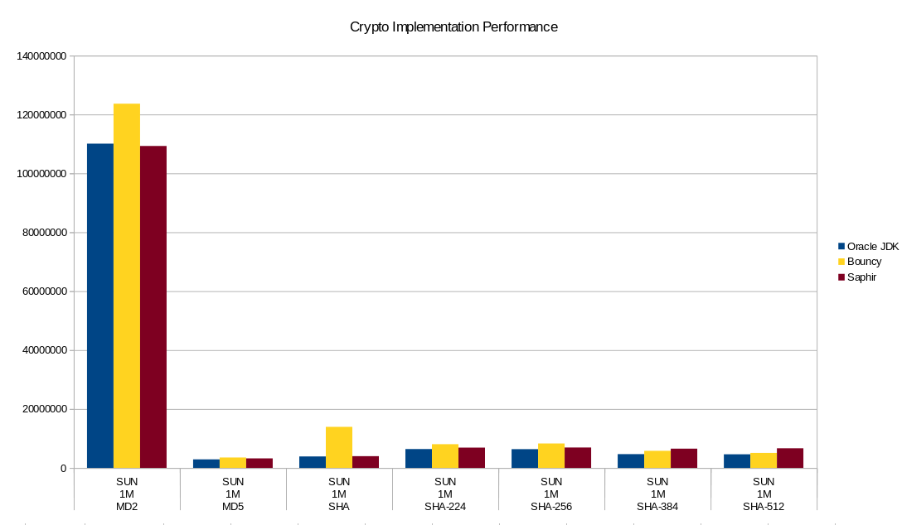

Saphir Hash
===================
 
[](https://www.codacy.com/app/sfuhrm/saphir-hash?utm_source=github.com&utm_medium=referral&utm_content=sfuhrm/saphir-hash&utm_campaign=badger) 
[](https://coveralls.io/github/sfuhrm/saphir-hash) 
[](https://maven-badges.herokuapp.com/maven-central/de.sfuhrm/saphir-hash-core) 
[](https://maven-badges.herokuapp.com/maven-central/de.sfuhrm/saphir-hash-jca) 


Saphir Hash is a Java library for calculating cryptographic message digests.
The library is derived from the sphlib 3.0 code that can be found here:

[http://www.saphir2.com/sphlib/](http://www.saphir2.com/sphlib/ "sphlib 3.0 project page")

The repackaged, mavenized and JCA-enabled version 3.0.3 and later can be found here:

[https://github.com/sfuhrm/saphir-hash](https://github.com/sfuhrm/saphir-hash "github saphir-hash project page")

Compared to the standard SUN message digest algorithm this library
contains many experimental hash algorithms.

List of algorithms:

* BLAKE224,256,384,512
* BMW224,256,384,512
* CubeHash224,256,384,512
* ECHO224,256,384,512
* Fugue224,256,384,512
* Groestl224,256,384,512
* Hamsi224,256,384,512
* HAVAL128_3,128_4,128_5,160_3,160_4,160_5,192_3,192_4,192_5,224_3,224_4,224_5,256_3,256_4,256_5
JH224,256,384,512
* Keccak224,256,384,512
* Luffa224,256,384,512
* MD2
* MD4
* MD5
* PANAMA
* RadioGatun32,64
* RIPEMD128,160
* SHA0,1,224,256,384,512
* Shabal192,224,256,384,512
* SHAvite224,256,384,512
* SIMD224,256,384,512
* Skein224,256,384,512
* Tiger2
* Tiger
* Whirlpool0,1
* Whirlpool

## Documentation

You can view the api docs online at http://api.sfuhrm.de/saphir-hash/
The documentation can be generated with the command

	mvn javadoc:aggregate

## Building

The library is built with Apache Maven. You can build it by
doing

	mvn clean package
	
in the top library folder.

## Authors

The original library was written by the "Projet RNRT SAPHIR", 
which is a research project sponsored by the French government; 
project members are public and private organizations:

* Cryptolog
* ANSSI
* École Normale Superieure
* France Telecom
* Gemalto

Projet RNRT SAPHIR was continued into Projet RNRT SAPHIR2, with four new additional members:

* Cassidian
* Morpho
* INRIA
* UVSQ

We use the "Projet RNRT SAPHIR" expression to designate both SAPHIR and SAPHIR2.

All the actual code has been written by:

   Thomas Pornin &lt;thomas.pornin at cryptolog.com&gt;
   
The additions were written by:

   Stephan Fuhrmann &lt;s at sfuhrm.de&gt;

## List of changes

The following is a rough list of changes and additions done by me,
Stephan Fuhrmann:

* Moved project structure to modern maven build with subprojects.
* Moved tests to JUnit tests
* Created JCA adapter to the digest algorithms
* Created speed benchmark code to compare against SUN and BouncyCastle implementations

## Maven dependencies

You can use the code using the Maven repository.

The core classes without JCA support is in this dependency (version may change):

```xml
<dependency>
	<groupId>de.sfuhrm</groupId>
	<artifactId>saphir-hash-core</artifactId>
	<version>3.0.3</version>
</dependency>
```

The JCA provider is contained in this dependency (version may change):

```xml
<dependency>
	<groupId>de.sfuhrm</groupId>
	<artifactId>saphir-hash-jca</artifactId>
	<version>3.0.3</version>
</dependency>
```

## Example usage

The following short example directly instantiates
fr.cryptohash.JCAProvider and calculates a digest over
the String "test" in the platforms default character encoding:

```java
        MessageDigest mdSH = MessageDigest.getInstance("MD5", new JCAProvider());
        mdSH.update("test".getBytes());
        byte mdSHDigest[] = mdSH.digest();
```

## Performance discussion

The following image shows the performance of different algorithm implementations
for a data size of 1M. The numbers are in nanoseconds:



The implementations are:
* JDK 1.8.0_121
* Bouncy Castle 1.46
* Saphir Hash JCA 3.0.3

## License

The original library is in a MIT-like license, the rest is in a BSD-like license.

See the file LICENSE.md for a detailed discussion.
